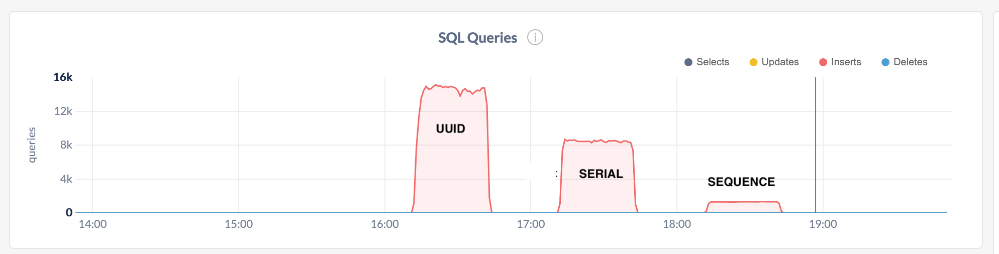
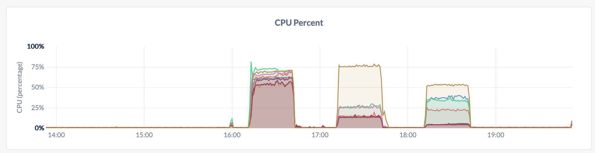

# AutoPK tests for CockroachDB
Primary keys are critical in any RDBMS in order to ensure the validity of data.  Unlike other distributed SQL databases, CockroachDB is **not** *sharded* by primary key to distribute the data.  Data is divided to ranges and distributed automatically among nodes in the cluster.  CockroachDB ranges are *sorted* by the primary key values.  So, while the value doesn't define the distribution, the *sorting* of the values can have implications if you use sequences that increment values in a count-like fashion.  This will put stress on a single RANGE of data which scaling of a distributed application.

For a full deep-dive into the architecture look at our [documentation](), [sigmod paper](), or take the self-directed **getting started** course at [CockroachDB University](https://www.cockroachlabs.com/cockroach-university/).

## Test Overview
Three tables were created each with a different PK generation method.  The `id` column is generated automatically by CockroachDB using various functions.  Once these were created, a simple Python3 program was created to run through the various test scenarios and report the results.  The tables contain the `id` primary key along with metadata about the run and timings. 

```sql
-- UUID using UUID data type
--
CREATE TABLE uuid_uuid
(
    id UUID DEFAULT gen_random_uuid(),
    thread_number int, 
    host STRING,
    port int,
    ts TIMESTAMP DEFAULT current_timestamp(),
    archive boolean DEFAULT false,
    PRIMARY KEY (id)
);

-- Serial using INT
--
CREATE TABLE id_serial
(
    id SERIAL,
    thread_number int,  
    host STRING,
    port int,
    ts TIMESTAMP DEFAULT current_timestamp(),
    archive boolean DEFAULT false,
    PRIMARY KEY (id)
);

-- Sequence using INT
--
CREATE SEQUENCE seqid INCREMENT BY 1;

CREATE TABLE id_seq (
    id INT DEFAULT nextval('seqid'),
    thread_number int,
    host STRING,
    port int,
    ts TIMESTAMP DEFAULT current_timestamp(),
    archive boolean DEFAULT false,
    PRIMARY KEY (id)
);
```

The test database and tables were created with the [create_ingestpkgen.sql](create_ingestpkgen.sql) script in this repository.

The tests were run for 30 minutes for each table type.  Once the runs were complete, the [ingest_report.sql](ingest_report.sql) script was run to generate the results from the embedded metadata within the tables.  Feel free to run this yourself using the [ingest-pk-concurrent.py](ingest-pk-concurrent.py) python3 script.  To setup Python3 and HAproxy for the driver environment, see below:

**Python3 install:**
```bash
sudo apt-get update -y
sudo apt install python3-pip -y
sudo pip3 install --upgrade pip
sudo apt-get install libpq-dev python-dev -y
sudo pip3 install psycopg2
```

**Setup HAproxy on Driver Machine:**

```bash
sudo apt-get update -y
sudo apt-get install haproxy -y
cockroach gen haproxy --insecure   --host=(SUT internal IP)   --port=26257
nohup haproxy -f haproxy.cfg &
```

## Results

After running the [ingest-pk-concurrent.py](ingest-pk-concurrent.py) script, the [ingest_report.sql](ingest_report.sql) SQL was run to generate the results below.

```sql
-- 9 node local cluster, replica = 3
--

  autopktable | threads | loadseconds | rowsloaded |     rowspersecond
+-------------+---------+-------------+------------+-----------------------+
  id_seq      |      36 |        1800 |    2327968 | 1293.3155555555555556
  id_serial   |      36 |        1800 |   15233642 | 8463.1344444444444444
  uuid_uuid   |      36 |        1800 |   25712259 | 14284.588333333333333
```


## Analysis
While it was expected that `UUID` would be the most optimal, it is instructive to **observe** the behaviour of the cluster while running these tests.  Below are some screenshots from the Cockroach DBconsole which show CPU resources and throughput during the runs.




The biggest observation is the distribution of CPU for the various scenarios.  Sequences hotspot on a single object that must be locked to be incremented.  SERIAL does a better job of distrubting generation, but there are some hotspots with hot ranges and splitting.  UUID on the other hand, is well distrubted throughout the cluster providing the most efficient use of resources.

## Misc Links

* [Sequences](https://www.cockroachlabs.com/docs/stable/create-sequence.html)
* [Serial](https://www.cockroachlabs.com/docs/stable/serial.html)
* [UUID](https://www.cockroachlabs.com/docs/stable/uuid.html "UUID")
* [gen_random_uuid()](https://www.cockroachlabs.com/docs/v20.2/functions-and-operators#id-generation-functions)

