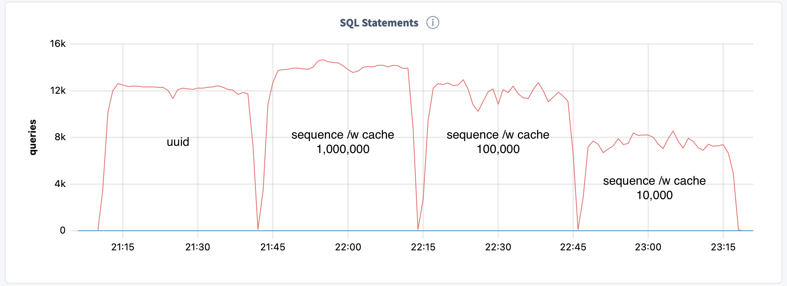
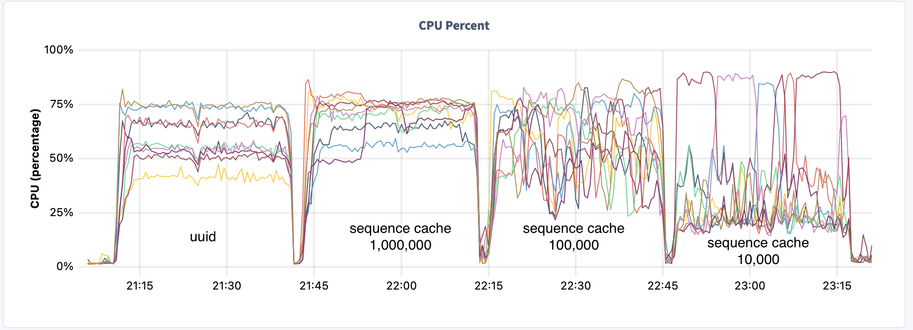

# Sequences with CACHE

Sequences that auto-increment are an anti-pattern to scaling ingest throughput with CockroachDB.  `UUID` was introduced to better distribute load with distributed SQL.  The issue is, not all applications can easily move to using a `UUID` as the primary key.  Often there are many sub-systems that rely on integers being used as the key.  To better optimize for these use cases, [cached sequences](https://www.cockroachlabs.com/docs/v21.1/create-sequence.html) were introduced.

By allowing each session to obtain a range of values, this lowers the hot-spot for a single counter.  Below are some tests run to ingest data into tables with *uuid* and *cached sequences* of 10k, 100k, and 1 million values.

## Schema for ingest tests

```sql
CREATE SEQUENCE s10000 CACHE 10000 INCREMENT BY 1;
CREATE SEQUENCE s100000 CACHE 100000 INCREMENT BY 1;
CREATE SEQUENCE s1000000 CACHE 1000000 INCREMENT BY 1;

CREATE TABLE s10000t (
    id INT DEFAULT nextval('s10000') PRIMARY KEY,
    host STRING,
    port INT,
    thread_number INT,
    ts TIMESTAMP DEFAULT current_timestamp(),
    archive boolean DEFAULT false
);

CREATE TABLE s100000t (
    id INT DEFAULT nextval('s100000') PRIMARY KEY,
    host STRING,
    port INT,
    thread_number INT,
    ts TIMESTAMP DEFAULT current_timestamp(),
    archive boolean DEFAULT false
);

CREATE TABLE s1000000t (
    id INT DEFAULT nextval('s1000000') PRIMARY KEY,
    host STRING,
    port INT,
    thread_number INT,
    ts TIMESTAMP DEFAULT current_timestamp(),
    archive boolean DEFAULT false
);

CREATE TABLE uuid_uuid
(
    id UUID DEFAULT gen_random_uuid() PRIMARY KEY,
    host STRING,
    port INT,
    thread_number INT,
    ts TIMESTAMP DEFAULT current_timestamp(),
    archive boolean DEFAULT false
);
```

## Test code

The [ingest-pk-concurrent.py](ingest-pk-concurrent.py) python script was created to test all of the table types.  This simple script is set to use 36 threads and run for 1800 seconds for each of the table types.  Running for this length of time minimizes any startup time to split ranges and migrate leases.  Notice that all rows are tagged with the `current_timestamp()` value.  This is used by the [ingest_report_v21.sql](ingest_report_v21.sql) to calculate the overall ingest rate for each table type.

Finally, this code can easily be modified to test ingest for your tables and workload.

## Results

When a thread can cache a batch of keys, the hot-spot for serialization is massively reduced.  In the extreme case where 1 million keys are cached, sequences with caching outpaces the `gen_random_uuid()` routine.  This makes sense as `UUID` is 128-bits and the *random* routines and the construction of the `UUID` require more CPU than a simple cached lookup.

```sql
  autopktable | threads | loadseconds | rowsloaded | rowspersecond
--------------+---------+-------------+------------+----------------
  uuid_uuid   |      36 |        1800 |   21708303 |         12060
  s1000000t   |      36 |        1800 |   24912664 |         13840
  s100000t    |      36 |        1800 |   21016436 |         11676
  s10000t     |      36 |        1800 |   13566724 |          7537
```




