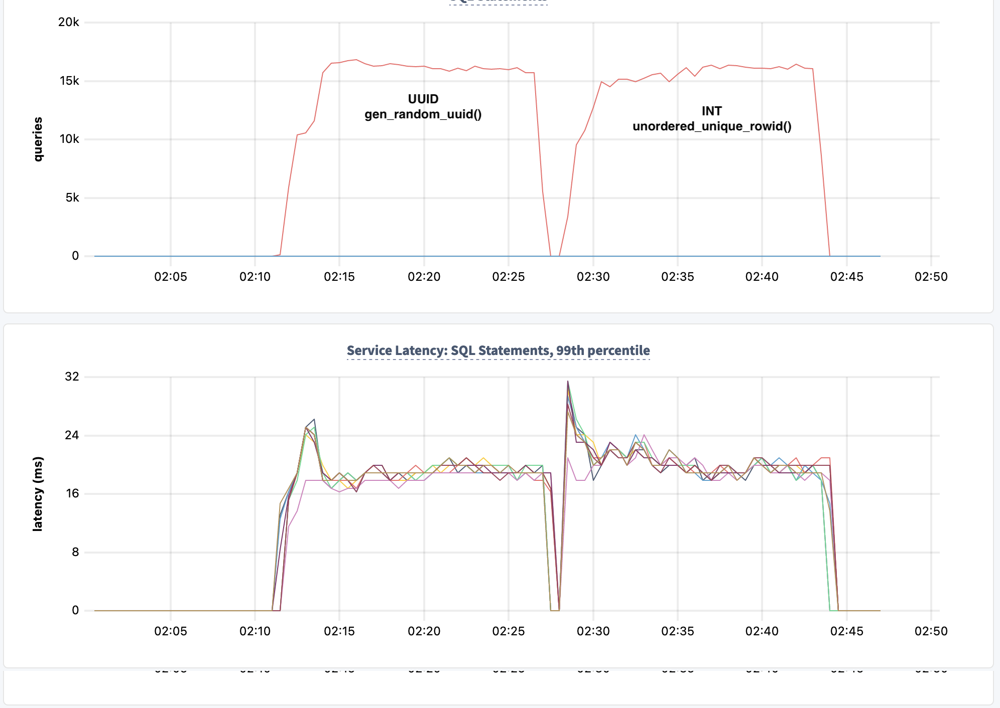
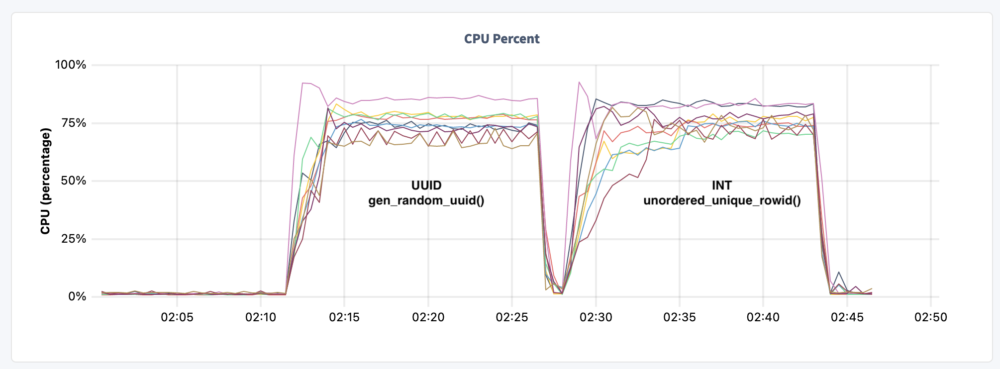
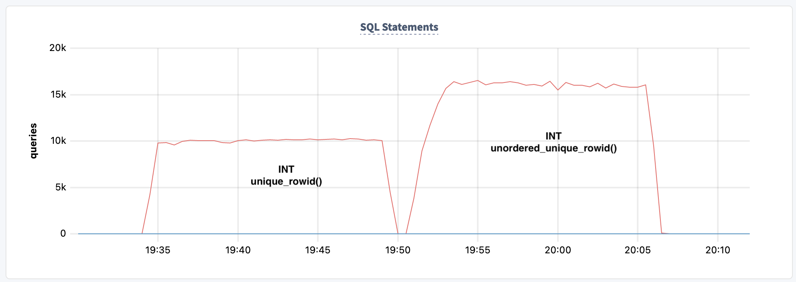
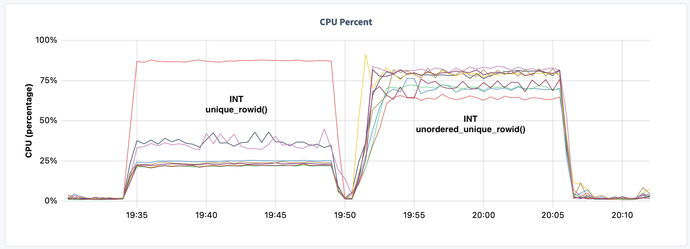
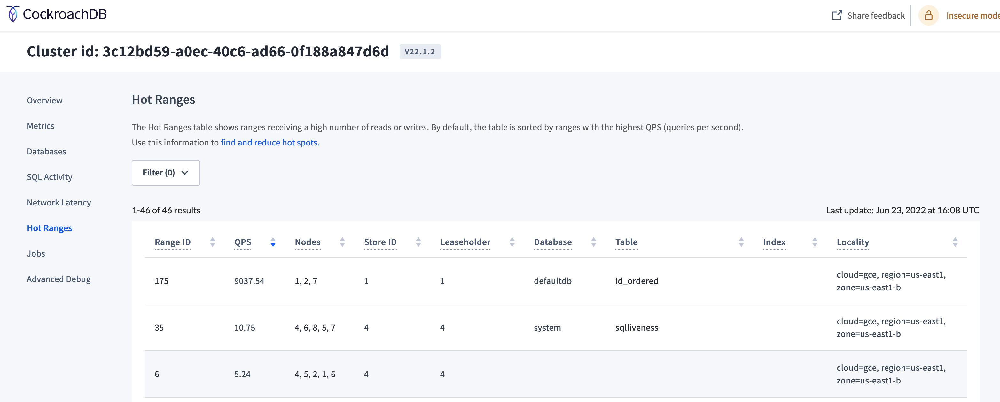

# Ingest Tests with unordered_unique_rowid() function

With distributed SQL datatabases, it is important that data gets distributed well across the nodes of the cluster.  This series of tests show how then new `unordered_unique_rowid()` function in v22.1 is able to compare to `unique_rowid()` as well as `gen_random_uuid()`.  For details on these built-in functions a [link](https://github.com/cockroachdb/cockroach/blob/6eb3bf0a6fba3554aaf6c74f60c06cf1a4316a67/pkg/sql/sem/builtins/builtins.go#L2155) to the code is provided.

## Results

Below are the results for various auto generation methods.

### UUID vs UNORDERED

Compare `gen_random_uuid()` with `unordered_unique_rowid()` for PK autogen.  You can see both methods provide similar results with excellent distribution of CPU across nodes.

```bash
       Table         QPS     respP99
------------------------------------
     id_uuid     15498.8    0.018954
id_unordered     15160.5    0.019994
```





### ORDERED vs UNORDERED

You can see there is 50% improvement for these tests by using the `unordered_unique_rowid()` to distribute activity across the cluster.

```bash
       Table       QPS     respP99
----------------------------------
id_ordered     10005.8    0.013958
id_unordered   15531.9    0.018635
```




The hotspotting caused by `unique_rowid()` can be seen by looking at the hotranges display in the DB console.


